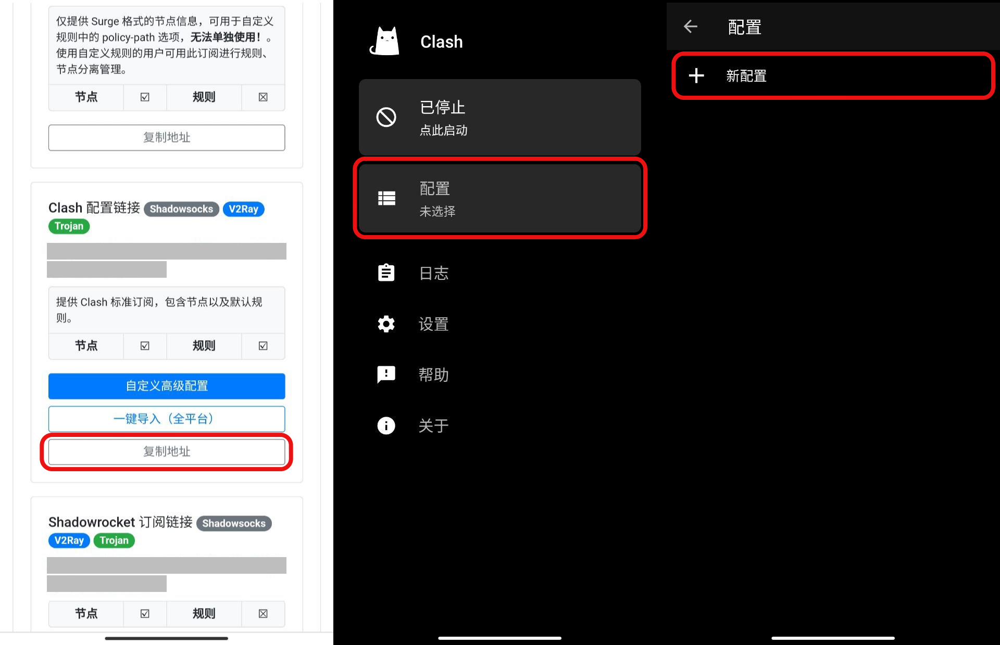

# Clash for Android 配置教程

## 安装

Clash For Android 是一款 Android 平台下的 clash 内核客户端，支持多种类代理协议。用户可从 [GitHub 官方 Releases](https://github.com/Kr328/ClashForAndroid/releases) 页面下载 `app-foss-universal-release.apk` 最新版安装，或从 [Google Play 商店 - Clash for Android](https://play.google.com/store/apps/details?id=com.github.kr328.clash) 直接安装。


安装后，请允许客户端有网络、VPN 权限，否则无法正常使用。


## 配置订阅

使用手机登陆 AgentNEO，点击右上角打开「**顶部菜单栏**」，选择「**我的服务**」。然后进入需要配置的服务，点击「**配置下载**」。

.jpg>)

### 自动配置

向下滑动到「**Clash 订阅链接**」处，点击「**一键导入（全平台）**」，浏览器会自动呼出 Clash for Android 客户端并且跳转到订阅配置界面，然后点击右上角「**磁盘** :floppy\_disk: 」图标保存订阅即可。

> 建议修改最下方自动更新参数为 360（每 6 小时更新一次）。

### 手动配置


如果点击「一键导入（全平台）」无法呼出 Clash for Android 客户端，可参考本小节进行手动订阅设置。


向下滑动到「**Clash 订阅链接**」处，点击「**复制地址**」，随后打开 Clash for Android，依次点击首页中的「配置」、「新配置」。

再点击「**URL - 从 URL 导入**」，进入订阅配置界面，并进行如下设置：

1. 将名称修改为「**AgentNEO**」以便识别订阅来源
2. 将复制的地址粘贴在「**URL**」文本框中
3. 将「自动更新（分钟）」设置为 360（每 6 小时自动更新一次）

最后点击右上角「**磁盘** :floppy\_disk: 」图标保存即可。

## 激活配置


点击「**磁盘** :floppy\_disk: 」图标保存后 Android 系统可能会自动跳转回到浏览器，只用再次打开 Clash for Android 即可。


打开 Clash for Android，点击「**配置 - 未选择**」进入配置列表，点击刚才导入的订阅配置以激活。再返回首页即可完成所有节点以及规则的配置订阅。

## 更新订阅配置

> 及时更新订阅配置是非常重要且有用的事情，这可以让你的节点、规则等信息保持最新，以获得更稳定和更快速的体验。

如想要更新订阅配置，在首页点击「**配置**」进入配置列表，点击想要更新配置项右侧的「**菜单（三个点）**」符号，选择「**更新**」即可。

## 使用 Clash for Android

1. 开启 / 关闭 VPN
   1. 点击「已停止 - 点击启动」打开 VPN
   2. 点击「运行中 - xxx 已转发」关闭 VPN
2. 点击「**代理**」可跳转到节点列表以切换节点。

