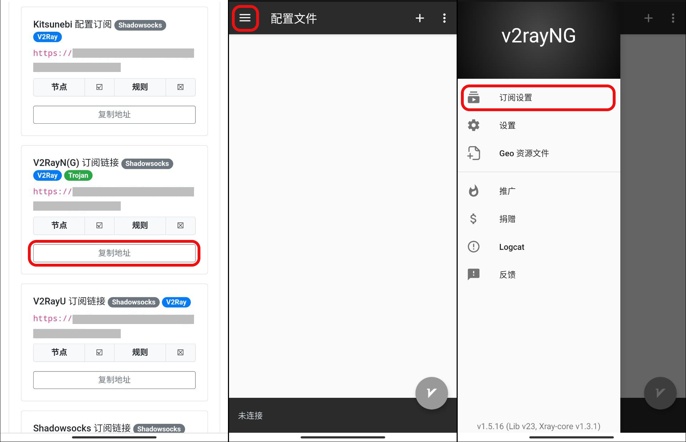
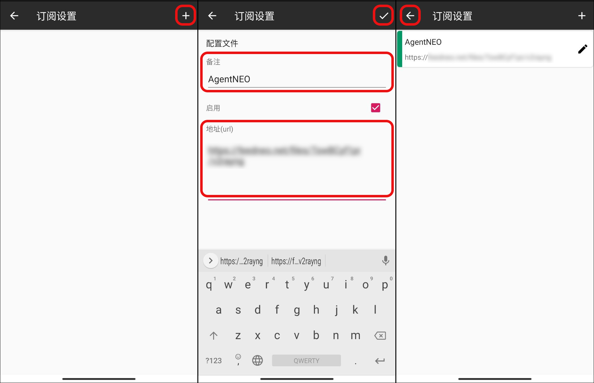
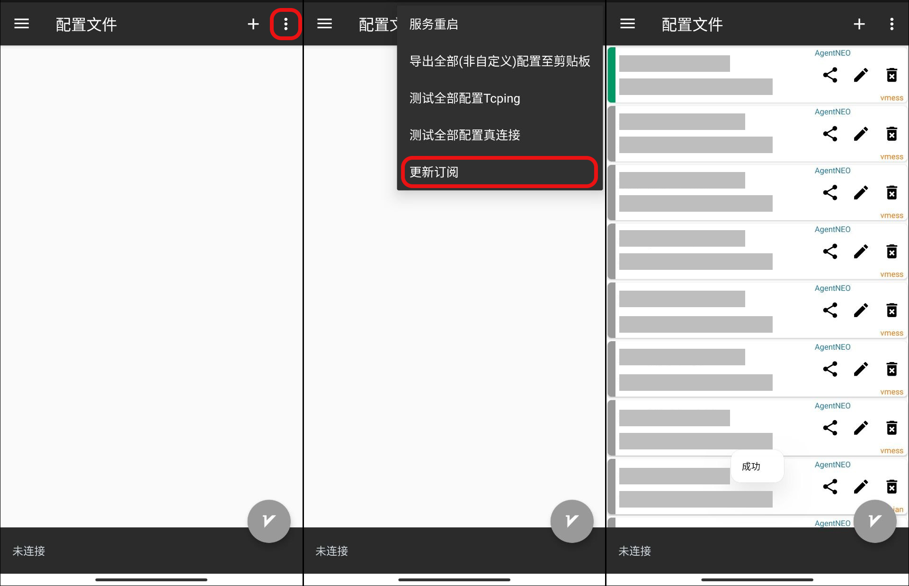

# v2rayNG 配置教程（仅节点）

## 安装

v2rayNG 是一个开源客户端，GitHub 地址：[https://github.com/2dust/v2rayNG](https://github.com/2dust/v2rayNG)。可以前往[官方 GitHub Releases](https://github.com/2dust/v2rayNG/releases) 进行下载安装或直接到 [Google Play - v2rayNG](https://play.google.com/store/apps/details?id=com.v2ray.ang) 安装。

## 配置订阅

使用手机登陆 AgentNEO，点击右上角打开「**顶部菜单栏**」，选择「**我的服务**」。然后进入需要配置的服务，点击「**配置下载**」。

.jpg>)

向下滑动到「v2rayN(G)** 订阅链接**」处，点击「**复制地址**」，随后打开 v2rayNG，点击首页左上角「**菜单**」-「**订阅设置**」进入订阅设置页面。

点击右上角「**加号** :heavy\_plus\_sign: 」，在备注中输入 AgentNEO 以便识别，URL 文本框中粘贴上面复制的节点订阅地址。再点击右上角「**勾** :heavy\_check\_mark: 」保存订阅即可。随后点击左上角「**返回** :back: 」返回首页。

点击右上角「**菜单**」按钮，选择「**更新订阅**」，随后即可拉取所有的节点配置。至此 v2rayNG 节点订阅已全部完成。


节点配置可能由于线路变动而导致一些节点配置无法使用，请定时更新订阅以保证线路为最新状态。


## 使用 v2rayNG

### 基础使用

1. 首页节点列表中选择需要使用的线路
2. 点击左下角「**V**」图标以开启、关闭 VPN

.png>)

### 分流规则

依次点击「**设置**」「**预定义规则**」，选择「**绕过局域网及大陆地址**」即可实现分流功能。

.png>)

