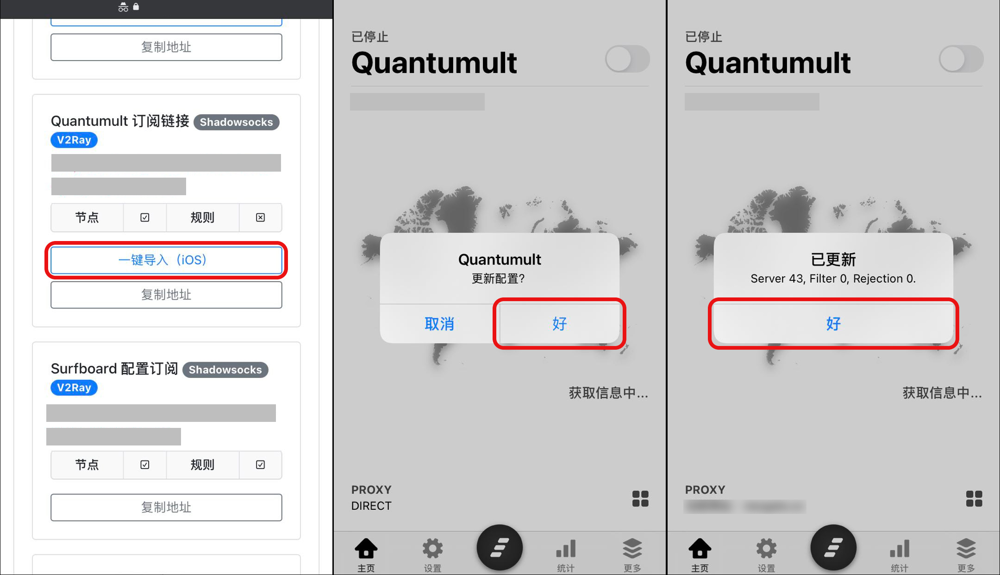

# Quantumult 配置教程


由于 Quantumult 已经停止维护，并且不支持更新的协议（如 vless、Trojan 等），所以非常不推荐新购用户购买。还请购买升级版本的 QuantumultX 或者 Shadowrocket 使用。


## 安装

Quantumult 是一款付费工具，由于众所周知的原因已经在国内 App Store 下架，用户需要自行从美区 App Store 购买。

Quantumult 美区 App Store 地址：[https://apps.apple.com/us/app/quantumult/id1252015438](https://apps.apple.com/us/app/quantumult/id1252015438)

## 导入配置

使用手机登陆 AgentNEO，点击右上角打开「**顶部菜单栏**」，选择「**我的服务**」。然后进入需要配置的服务，点击「**配置下载**」。

.jpg>)

下滑到「**Quantumult 配置链接**」处，点击「**一键导入（iOS）**」，浏览器会自动呼出 Quantumult 客户端并且自动导入所有节点配置信息。

至此，一个包含所有节点配置已经订阅完成。
