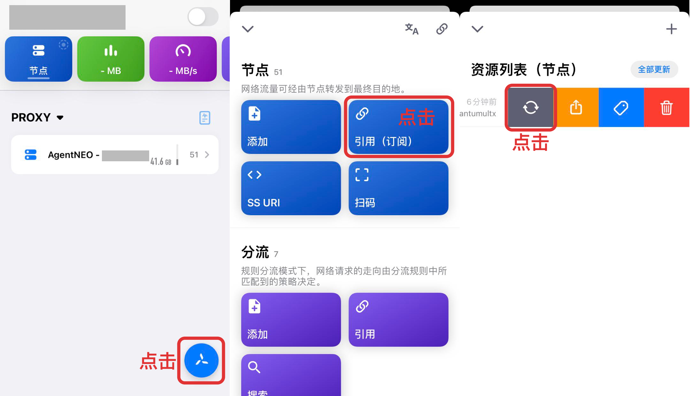

# QuantumultX 配置教程（仅节点）


此配置教程仅包含节点的订阅，需要另配置自定义规则才能正常使用。建议新手参见包含规则项的 [QuantumultX 配置教程](https://docs.neobook.co/ios/quantumultx-pei-zhi-jiao-cheng)。


## 安装

QuantumultX 是一款付费工具，由于众所周知的原因已经在国内 App Store 下架，用户需要自行从美区 App Store 购买。

美区 App Store QuantumultX 链接： [https://apps.apple.com/us/app/quantumult-x/id1443988620](https://apps.apple.com/us/app/quantumult-x/id1443988620)

## 导入节点配置

使用手机登陆 AgentNEO，点击右上角打开「**顶部菜单栏**」，选择「**我的服务**」。然后进入需要配置的服务，点击「**配置下载**」。

.jpg>)

下滑到「**QuantumultX 节点订阅**」位置，点击「**一键导入（iOS）**」。随后呼出 QuantumultX 客户端，点击「好」以更新配置文件即可完成节点信息导入。

.jpg>)

至此一个包含所有节点的订阅配置已经绑定完成。

## 更新订阅配置

> 及时更新订阅配置是非常重要且有用的事情，这可以让你的节点、规则等信息保持最新，以获得更稳定和更快速的体验。

想要在 QuantumultX 中更新订阅配置，请点击右下角「**QuantumultX 图标**」，选择「**引用（订阅）**」，在「**资源列表（节点）**」中向左滑动想要更新的订阅配置，选择灰色的「**更新**」按钮即可立即更新所有节点配置信息。

