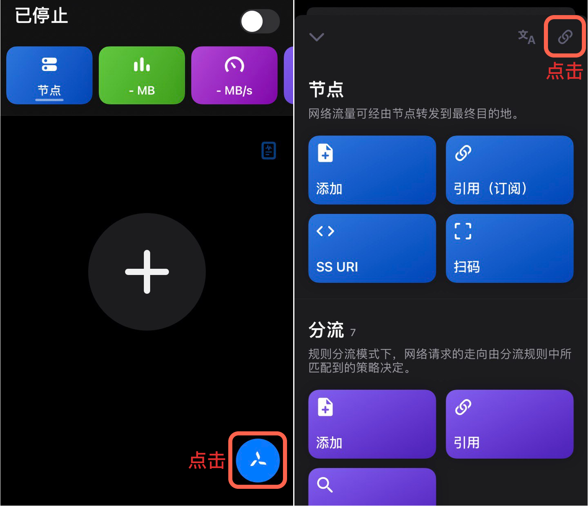
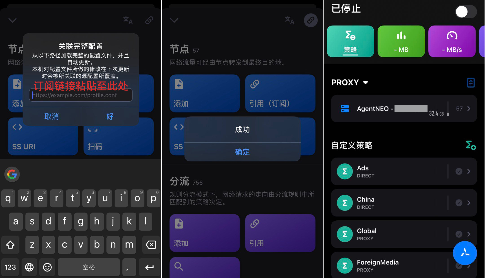
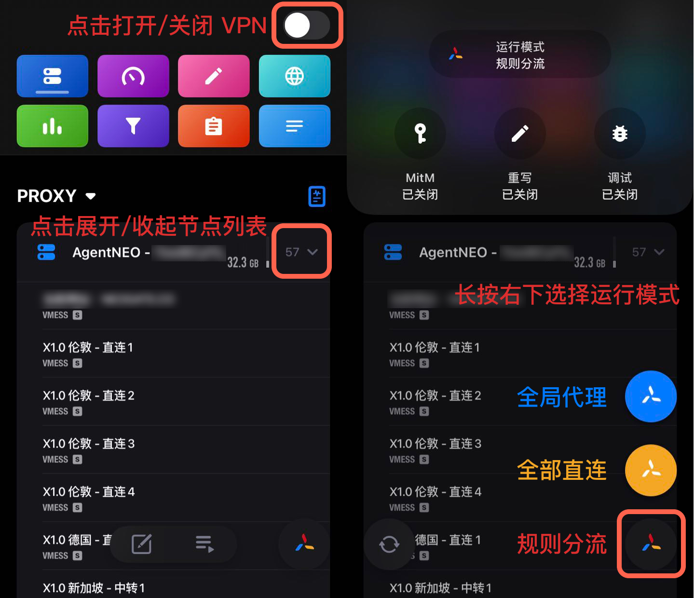
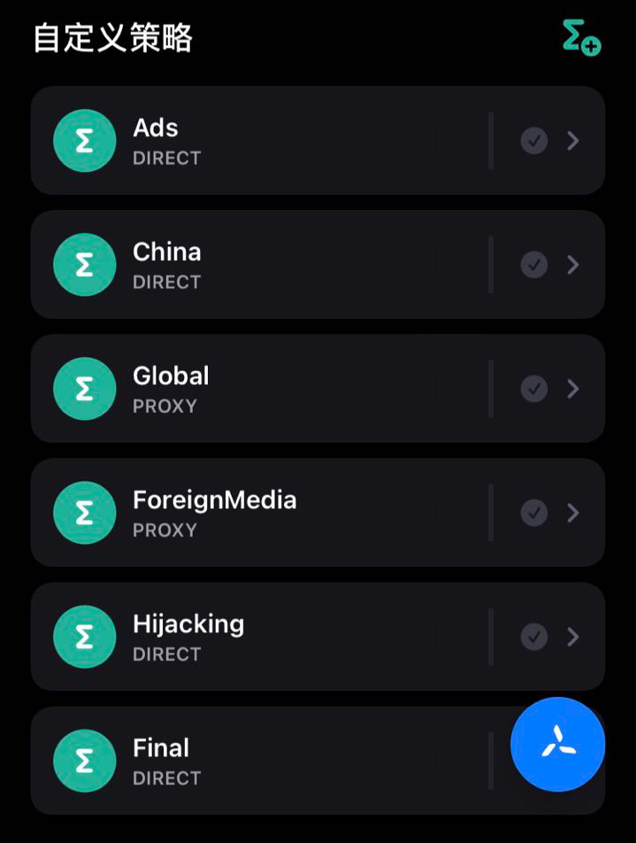

# QuantumultX 配置教程

## 安装

QuantumultX 是一款付费工具，由于众所周知的原因已经在国内 App Store 下架，用户需要自行从美区 App Store 购买。

美区 App Store QuantumultX 链接： [https://apps.apple.com/us/app/quantumult-x/id1443988620](https://apps.apple.com/us/app/quantumult-x/id1443988620)

## 导入配置

使用手机登陆 AgentNEO，点击右上角打开「**顶部菜单栏**」，选择「**我的服务**」。然后进入需要配置的服务，点击「**配置下载**」。

.jpg>)

下滑到「**QuantumultX 配置链接**」处，点击「**复制地址**」。

.jpg>)

在手机上打开 QuantumultX 客户端，点击「**右下角 QuantumultX 图标**」后，在弹窗中点击右上角「**链接 **:link: 」按钮。

在弹出对话框中粘贴刚才复制的 QuantumultX 配置链接后确认即可。至此一个包含部分高级策略的 QuantumultX 已全部配置完成。

## 更新订阅配置

> 及时更新订阅配置是非常重要且有用的事情，这可以让你的节点、规则等信息保持最新，以获得更稳定和更快速的体验。

想要在 QuantumultX 中更新订阅配置，请点击右下角「**QuantumultX 图标**」，再点击弹出对话框右上角「**链接**:link:」按钮，选择「**立即更新**」即可。

.jpg>)

## 使用

### 基础用法

1. 点击节点订阅组右侧箭头**展示/选择**节点；点击右上开关以**开启/关闭** VPN。
2. 长按右下角图标更换运行模式，不同颜色分别代表：
   1. 蓝色 - 全局代理
   2. 黄色 - 全部直连
   3. 彩色 - 规则分流

### 集成的内置策略

| DIRECT         | PROXY      | REJECT |
| -------------- | ---------- | ------ |
| 直连             | 代理         | 拒绝     |
| 即为不通过代理服务器直接请求 | 通过代理进行连接请求 | 拒绝请求   |

1. **Ads** - 包含广告、数据追踪等常见域名，默认为**直连**，可设置为**拒绝**达到屏蔽广告的目的。
2. **China** - 包含大部分常见的国内网站、应用规则，默认为**直连**，可选**代理。**
3. **Global** - 包含大部分国际被墙域名规则，默认**代理**，可选**直连。**
4. **ForeignMedia** - 包含大部分国际被墙流媒体域名规则，默认**代理**，可选**直连。**
5. **Hijacking** - 包含大部分臭名昭著的劫持域名，默认**直连**，可选**拒绝。**
6. **Fina** - 没有匹配到上述规则的最终策略，默认**直连**，可选**代理。**

