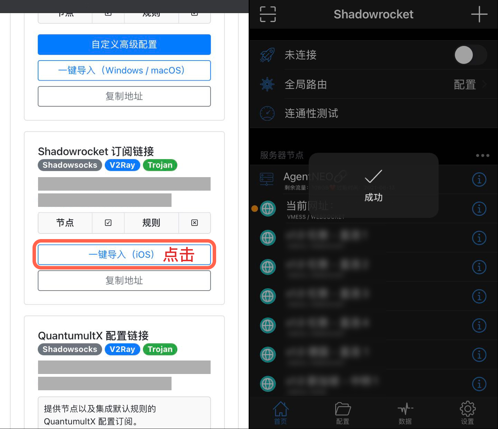
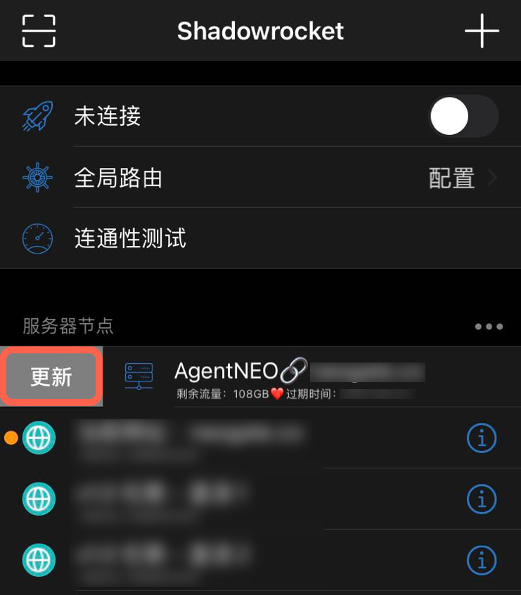
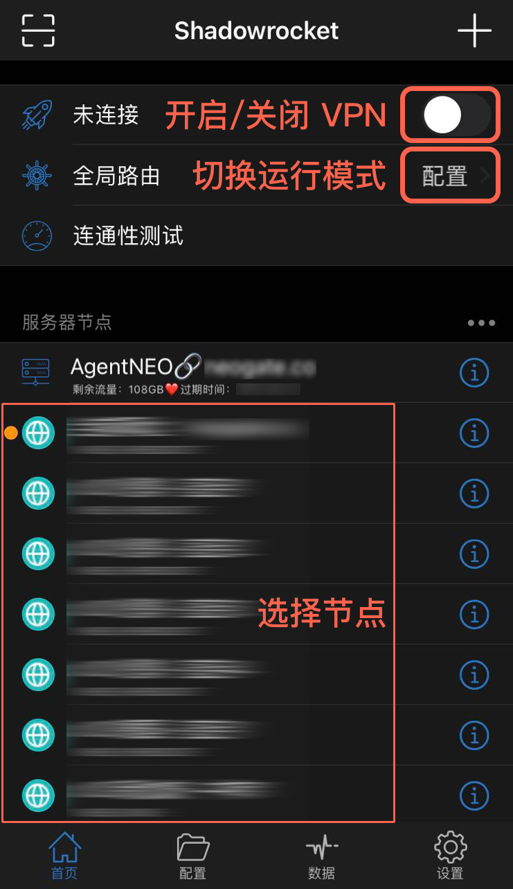

# Shadowrocket 配置教程（仅节点）

## 安装

Shadowrocket 是一个付费工具，由于众所周知的原因已经在国内 App Store 下架，用户需要自行从美区 App Store 购买、安装。

Shadowrocket 美区 App Store 链接：[https://apps.apple.com/us/app/shadowrocket/id932747118](https://apps.apple.com/us/app/shadowrocket/id932747118)

## 配置

使用手机登陆 AgentNEO，点击右上角打开「**顶部菜单栏**」，选择「**我的服务**」。然后进入需要配置的服务，点击「**配置下载**」。

.jpg>)

向下滑动到「**Shadowrocket 订阅链接**」处，点击「**一键导入（iOS）**」，浏览器会自动呼出 Shadowrocket 客户端并且自动导入所有节点配置信息。

至此，所有节点配置已经订阅完成。

## 更新订阅配置

> 及时更新订阅配置是非常重要且有用的事情，这可以让你的节点、规则等信息保持最新，以获得更稳定和更快速的体验。

想要在 Shadowrocket 中更新节点配置信息非常简单，只需在首页中向右滑动订阅条目，点击「**更新**」即可完成。

## 使用

1. 在顶部开关处控制开启、关闭 Shadowrocket
2. 全局路由即运行模式，可选择想要的模式进行使用
   1. 配置 - 根据配置文件规则转发流量 —— 规则模式
   2. 代理 - 通过代理转发流量 —— 全局代理模式
   3. 直连 - 不实用代理转发流量 —— 直连模式
3. 在服务器节点处可根据需求选择不同节点进行使用

