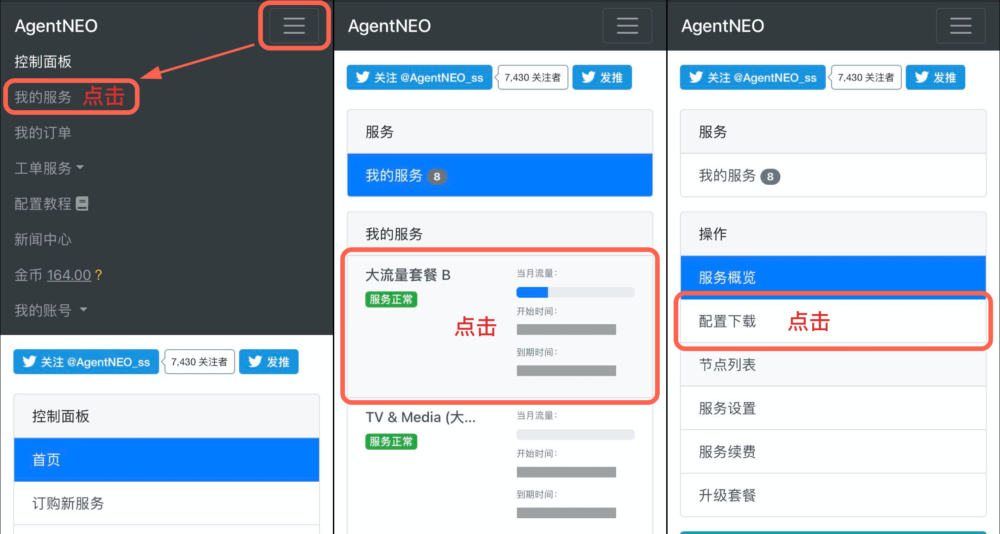
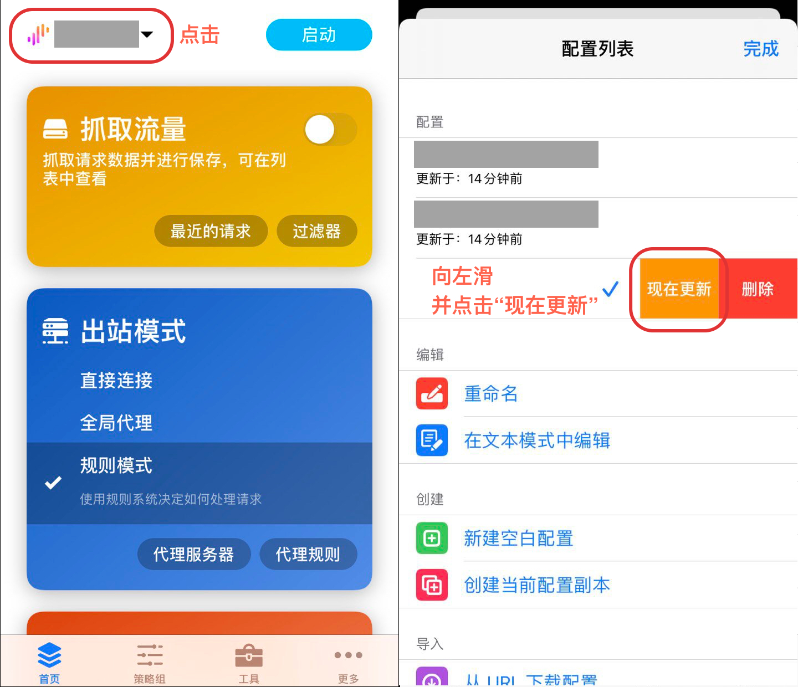
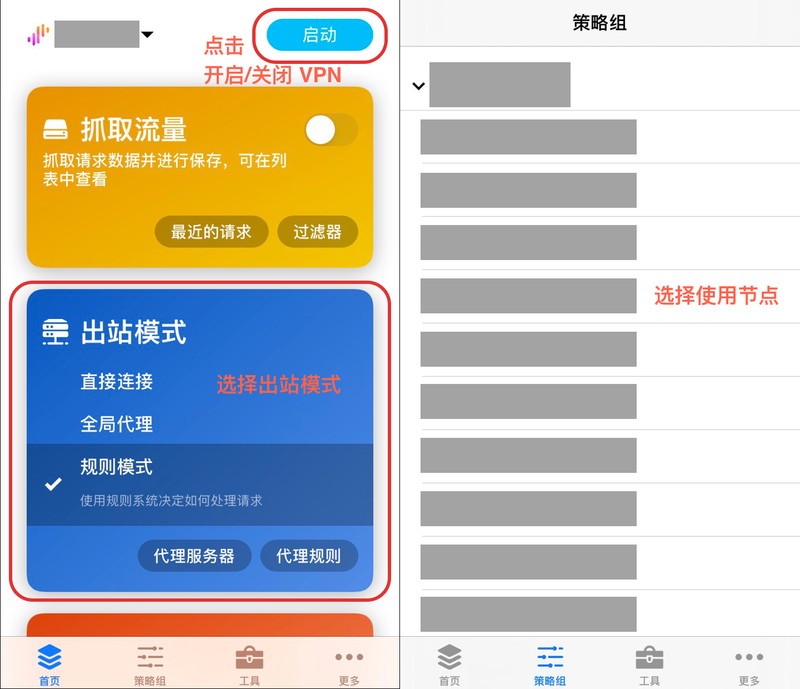

# Surge 配置教程


现在 Surge 虽然可以免费下载，但如果不进行购买 Pro 版本，是无法使用我们服务的，还请知晓。


## 安装

Surge for iOS 是一款付费应用，由于众所周知的原因，在国内 App Store 无法购买，如有需要，请到美区 App Store 购买安装。

Surge App Store 链接：[https://apps.apple.com/us/app/surge-4/id1442620678](https://apps.apple.com/us/app/surge-4/id1442620678)

## 配置（自动导入）

使用手机登陆 AgentNEO，点击右上角打开「**顶部菜单栏**」，选择「**我的服务**」。然后进入需要配置的服务，点击「**配置下载**」。

下滑到「**Surge 配置链接**」处，点击「**一键导入 iOS**」。

随后手机会自动呼出 Surge 并识别订阅链接地址，点击确认即可完成所有配置工作。

.jpg>)

## 更新订阅

> 及时更新配置订阅是非常重要且有用的事情，这可以让你的节点、规则等信息保持最新，以获得更稳定和更快速的体验。

想要更新订阅配置，请点击**首页**左上角「**Surge 配置**」按钮，在弹出的「**配置列表**」中选择想要更新的订阅向左滑动并点击「现在更新」即可。

## 使用

1. 首页
   * 上方可开启/关闭 VPN
   * 出站模式中可选择 Surge 运行模式
2. 策略组
   * 可选择不同地区节点线路使用

