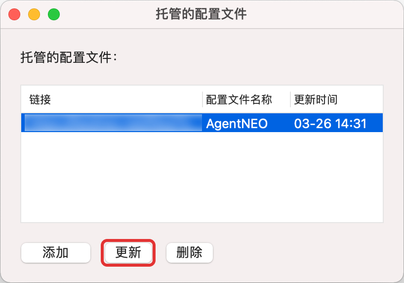
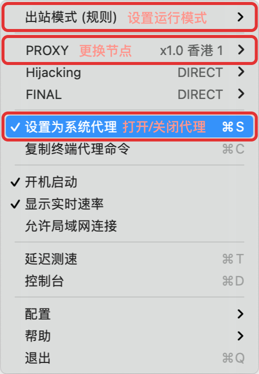

# ClashX 配置教程

## 安装

ClashX 是一款基于 clash 内核的开源 macOS 客户端。可以在其「[官方 Releases](https://github.com/yichengchen/clashX/releases)」页面进行免费下载安装。

安装后打开 ClashX 同意权限申请，确认在系统菜单栏中有 ClashX 的标识。

## 配置订阅

打开浏览器登陆 AgentNEO，点击套餐进入套餐详情。

点击右侧「**配置链接**」。

### 一键导入

下滑到「**Clash 配置链接**」处，点击「**一键导入（全平台）**」，


如果点击「一键配置（全平台）」没有响应，请参考下面手动导入一节。


浏览器会自动呼出 ClashX 客户端，点击「**打开 ClashX.app**」以确认。

.png>)

随后会自动打开 ClashX 的托管配置窗口并自动填入订阅信息。点击确认即可完成。

### 手动导入

下滑到「**Clash 配置链接**」处，点击「**复制地址**」，

.jpg>)

随后点击系统菜单栏中的 ClashX 图标，依次点击「**配置**」-「**托管配置**」-「**管理**」打开托管配置管理窗口。

点击「**添加**」后，将复制的订阅链接粘贴到 URL 文本框中，Config Name 输入 _AgentNEO_ 以便于识别。设置完成后点击「**确定**」即可完成手动配置。

.jpg>)

## 更新订阅配置

> 及时更新订阅配置是非常重要且有用的事情，这可以让你的节点、规则等信息保持最新，以获得更稳定和更快速的体验。

点击系统菜单栏中的 ClashX 图标，依次点击「**配置**」-「**托管配置**」-「**管理**」打开托管配置管理窗口。

选中需要更新的订阅点击下方「**更新**」即可更新订阅节点、规则。

## 使用 ClashX

1. 开启 / 关闭 ClashX
   * 将「设置为系统代理」选项激活 / 反激活
2. 设置运行模式
   * 全局连接 - 所有请求通过节点代理
   * 规则判断 - 根据配置规则进行自动分流，按照规则列表设置运行
   * 直接连接 - 所有请求都不通过节点代理，直接从本地发起请求

