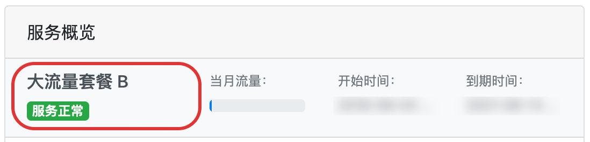

# clash 原生客户端命令行教程（推荐）

## 安装

前往[官方 Releases](https://github.com/Dreamacro/clash/releases) 页面下载对应平台的 clash 二进制文件，解压后执行以下步骤以确保 clash 能够正常启动（其中 `x.y.z` 代表对应版本好，用户需要自行进行替换）。

```bash
chmod +x clash-darwin-amd64-vx.y.z # 赋与可执行权限
cp clash-darwin-amd64-vx.y.z /usr/local/bin/clash # 添加到用户可执行文件目录
```


注意，在 macOS 下，首次运行 clash 会被系统安全策略阻止，用户需要手动在「系统偏好设置」-「安全与隐私」中允许 clash 运行。


## 配置下载

打开浏览器登陆 AgentNEO，点击套餐进入套餐详情。



点击右侧「**配置链接**」。


下滑到「**Clash 配置链接**」处，点击「**复制地址**」，

.jpg>)

而后在 shell 中执行以下步骤以下载 clash 配置（其中 `https://example.com/files/clash.yml`为用户复制的链接，需要自行替换）。

```bash
mkdir /usr/local/etc/clash # 创建配置文件夹
wget -P /usr/local/etc/clash https://example.com/files/clash.yml # 下载订阅文件到本地
```

## 运行 clash

执行 `clash -f /usr/local/etc/clash/clash.yml` 即可运行 clash 并打印暴露在本地的代理服务端口，默认为 `127.0.0.1:7890`。

更多 clash 运行时控制可参见[官方文档](https://github.com/Dreamacro/clash/wiki/external-controller-API-reference)。

## 测试代理
