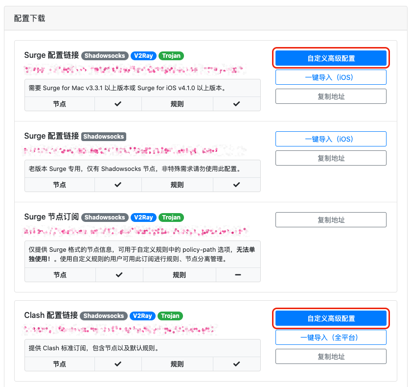

# 自定义托管配置

由于本站针对 Surge、Clash 提供了托管配置，包含了节点信息和规则等配置，但默认规则却没有办法满足所有用户的需求。为此，本站针对以上两个客户端订阅规则，提供了「自定义高级配置」功能，用户可在订阅卡片中点击此按钮进去对应客户端的自定义规则编辑页面。入口如下：

进入后，在「**自定义规则」**一栏即可添加自己所需的域名规则。其中 PROXY 表示代理，DIRECT 表示直连。

### Surge 规则页面示例

.png>)

### Clash 规则页面示例


注意 Clash 规则需要适配 yaml 文件格式，即每行前需要添加「减号空格」。


.png>)
