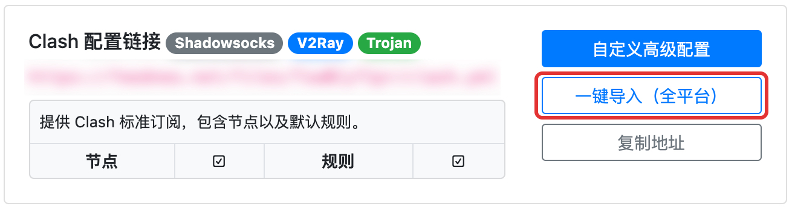

# Clash for Windows 配置教程

## 安装

Clash for Windows 是一款基于 clash 内核的 Windows 平台客户端，可在其[官方 GitHub Releases](https://github.com/Fndroid/clash\_for\_windows\_pkg/releases) 页面进行下载安装。

安装后打开 Clash for Windows 后进行下一步配置订阅。


Windows 用户下载 `Clash.for.Windows.Setup.x.y.z.exe` 即可（其中 x.y.z 是版本号）。


## 配置订阅

打开浏览器登陆 AgentNEO，点击套餐进入套餐详情。

点击右侧「**配置链接**」。

### 一键导入&#x20;

下滑到「**Clash 配置链接**」处，点击「**一键导入（全平台）**」，


如果点击「一键配置（全平台）」没有响应，请参考下面手动导入一节。


浏览器会自动呼出 ClashX 客户端，点击「**打开 Clash for Windows**」以确认。

.jpg>)

随后会自动打开 Clash for Windows 并自动记录订阅配置。可点击 Clash for Windows 的「**Profiles**」选项卡以确认订阅成功。点击 AgentNEO 订阅配置以激活此配置使用。

.png>)

### 手动导入

下滑到「**Clash 配置链接**」处，点击「**复制地址**」，

.jpg>)

随后打开 Clash for Windows 主窗口，点击「**Profiles**」选项卡。将刚才复制的订阅地址粘贴到「**Download from a URL**」文本框中，点击右侧「**Download**」下载订阅配置即可。

.png>)

## 更新订阅配置

> 及时更新订阅配置是非常重要且有用的事情，这可以让你的节点、规则等信息保持最新，以获得更稳定和更快速的体验。

### 设置自动更新

打开 Clash for Windows 主窗口，点击「**Profiles**」选项卡，点击「**齿轮**」按钮，在弹出的对话框下方「**Update Interval (hour)**」文本框中填入数字「**6**」将自动更新间隔设置为每 6 小时一次。

.png>)

### 手动更新

打开 Clash for Windows 主窗口，点击「**Profiles**」选项卡，点击「**刷新**」按钮即可立即更新订阅配置。

.png>)

## 使用 Clash for Windows

### 基础使用

1. 开启 / 关闭 Clash for Windows
   * 「**General**」选项卡，点击「System Proxy」开启 / 关闭系统代理
2. 更新 Clash for Windows 版本
   * 点击标题右侧版本号以自动下载更新

.png>)

### 切换运行模式、选择节点

「**Proxies**」选项卡，上方「Global」「Rule」「Direct」为运行模式，下方即是所有可用节点以供选择。

* Global - 全局连接 - 所有请求通过节点代理
* Rule - 规则判断 - 根据配置规则进行自动分流，按照规则列表设置运行
* Direct - 直接连接 - 所有请求都不通过节点代理，直接从本地发起请求

.png>)
