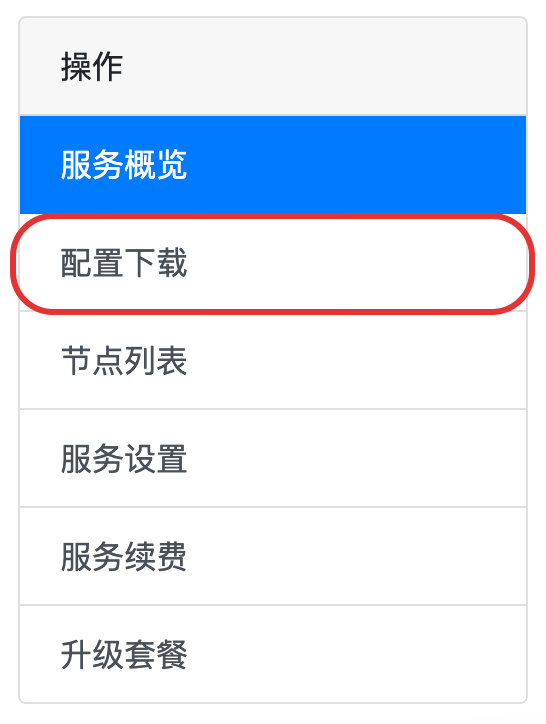

# Clash.NET 配置教程

## 安装

Clash.NET 是一款基于 clash 内核的 Windows 平台客户端，可在其[官方 GitHub Releases](https://github.com/ClashDotNetFramework/ClashDotNetFramework/releases) 页面进行下载安装。

安装后打开 Clash.NET 后进行下一步配置订阅。

## 配置订阅

打开浏览器登陆 AgentNEO，点击套餐进入套餐详情。

点击右侧「**配置下载**」。

### 一键导入

下滑到「**Clash 配置链接**」处，点击「**一键导入（全平台）**」


如果点击「一键配置（全平台）」没有响应，请参考下面手动导入一节。


浏览器会自动呼出 Clash.NET 客户端，点击「**打开 ClashDotNet**」以确认。

.png>)

随后会自动调用 Clash.NET 并自动记录订阅配置。可点击 Clash.NET 的「**配置**」选项卡以确认订阅成功。点击 AgentNEO 订阅配置以 **激活 **此配置使用。


激活的配置颜色会变成主题主色，未被激活的配置则是灰色。


### 手动导入

下滑到「**Clash 配置链接**」处，点击「**复制地址**」，

.jpg>)

随后打开 Clash.NET 主窗口，点击「**Profiles**」选项卡。点击「 :heavy\_plus\_sign: 」将刚才复制的订阅地址粘贴到弹出的对话框中，点击右侧「**订阅**」下载订阅配置即可。

随后 Clash.NET 下载订阅配置。可点击 Clash.NET 的「**配置**」以确认订阅成功。点击 AgentNEO 订阅配置以 **激活 **此配置使用。


激活的配置颜色会变成主题主色，未被激活的配置则是灰色。


## 更新订阅配置


及时更新订阅配置是非常重要且有用的事情，这可以让你的节点、规则等信息保持最新，以获得更稳定和更快速的体验。


### 设置自动更新

进入「**配置**」选项卡，点击 AgentNEO 订阅配置卡片下方的「 :gear: 」图标。

在弹出对话框中将「**更新周期**」改为 12 小时（意味着每 12 小时自动更新节点信息以保证所有线路正常），再点击确认即可。

### 手动更新

进入「**配置**」选项卡，点击 AgentNEO 订阅配置卡片下方的「 :arrows\_clockwise: 」图标即可立刻更新订阅，拉取到最新的节点信息。

## 使用 Clash.NET

### 基础使用

1. 右侧控制面板「**系统代理**」按钮可开启 / 关闭系统代理
2. 订阅配置右侧下拉菜单可切换 Clash.NET 运行模式，分别为规则 Rule、全局 Global、直连 Direct
3. 在「**主页**」「**代理**」选项卡中可选择不同节点进行使用
4. 在「**主页**」「**代理**」选项卡中右侧则是内置策略组：
   1. PROXY 匹配了一些常见的背墙域名，选择不同节点进行访问
   2. Hijacking 匹配了一些常见劫持域名，可选「Direct 直连」或「Reject 拒绝」
   3. FINAL 则是未匹配到的域名最后的策略，可选「Direct 直连」或「Proxy 代理」

